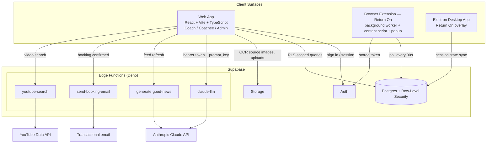
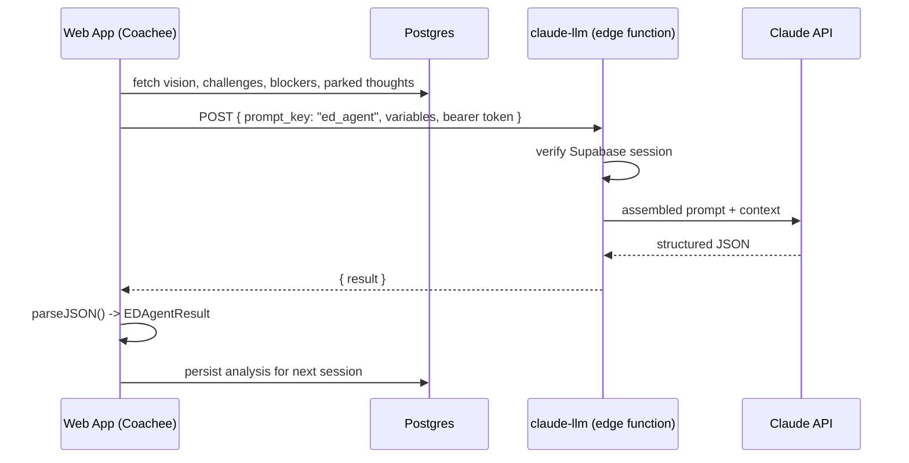

# Nudged — System Architecture

**Status:** Live product, actively evolving
**Owner:** Vishwas Jayarama
**Source:** Derived from codebase (graphify knowledge graph: 540 nodes, 42 communities) + Supabase migration history, 2026-08-15
**Related:** [Platform PRD](../product/nudged-platform-prd.md)

---

## 1. System Overview

Three client surfaces share one Supabase backend. All AI and third-party calls are proxied through edge functions — no external API key ever ships to a client.

> Return On (extension + desktop) talks only to Postgres and Auth — it never calls the AI proxy directly, keeping the focus-timer surface minimal.

## 2. AI Request Flow

The ED Agent call is representative of every AI feature: gather context client-side, send only a prompt key and variables to the proxy, persist the structured result.

Same shape for Thought Agent, Wise Advice, and the capsule chatbot — only the `prompt_key` and the context gathered up front change.

## 3. Key Data Entities

| Entity | Owned by | Purpose |
|---|---|---|
| `Coach` / `CoachProfile` | Coach | Identity, branding, philosophy, tone |
| `Coachee` | Coach | Intake profile: profession, family context, comfort, privacy preference |
| `Capsule` | Coach | Packaged program — public/private, optional passkey, attached goals |
| `CoachingSession` / `StoredSession` | Coach + Coachee | Session record and Return On focus-session state respectively |
| `Vision`, `vision_challenges`, `vision_blockers` | Coachee | Input to ED Agent and Wise Advice |
| `wise_advice_messages` | Coachee | Chat history feeding future AI context |
| `parked_thoughts` | Coachee | Captured-but-unresolved thoughts, also feed ED Agent |
| `Booking` | Coach + Coachee | Scheduled sessions via public calendar |
| `ChatbotConfig` | Coach (per capsule) | Drives the capsule knowledge chatbot |
| `AppFeedback`, `LoginEvent`, `CreditRequest`, `ExemptEmail` | Admin | Platform operations |

## 4. Tech Stack

| Layer | Stack |
|---|---|
| Web frontend | React 18, TypeScript, Vite, React Router, Tailwind CSS |
| Extension | Chrome Manifest (background service worker + content script + popup), `@types/chrome` |
| Desktop | Electron (main + renderer + overlay windows) |
| Backend | Supabase — Postgres, Row-Level Security, Auth, Storage, Edge Functions (Deno) |
| AI | Anthropic Claude, proxied server-side via `claude-llm` edge function |
| OCR | `tesseract.js` (client-side, bulk goal upload) |
| Third-party | YouTube Data API (video search), transactional email (booking confirmations) |

## 5. Known Architectural Risks

Carried over from the PRD's risk table — the items with system-design implications rather than pure product ones.

| Risk | Where | Why it matters |
|---|---|---|
| RLS correctness | Supabase policies | Migration history shows repeated recursion and access fixes for coach/coachee row access — the highest-churn area of the schema and the one most likely to leak or block data. |
| Cross-device session state | Return On (extension + desktop) | Focus sessions sync via a 30s Supabase poll rather than realtime — a session started on desktop can lag or double-fire on the browser. |
| LLM proxy failure | All AI features | `callLLM()` throws on any non-OK response; every AI surface needs its own loading/error handling since a single shared proxy fronts them all. |
| Hardcoded admin identity | `ADMIN_EMAIL` constant | Platform-admin access is a single hardcoded email rather than a role table — a single point of failure for admin access control. |

---

*Compiled from the Nudged codebase (graphify knowledge graph: 540 nodes, 42 communities) and the Supabase migration history. Treat as a living baseline — re-derive after major feature work rather than hand-editing.*
